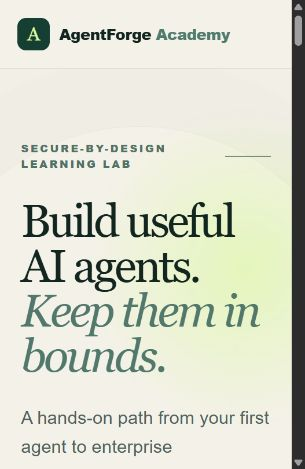
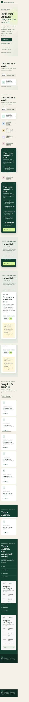
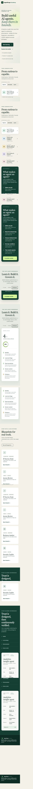
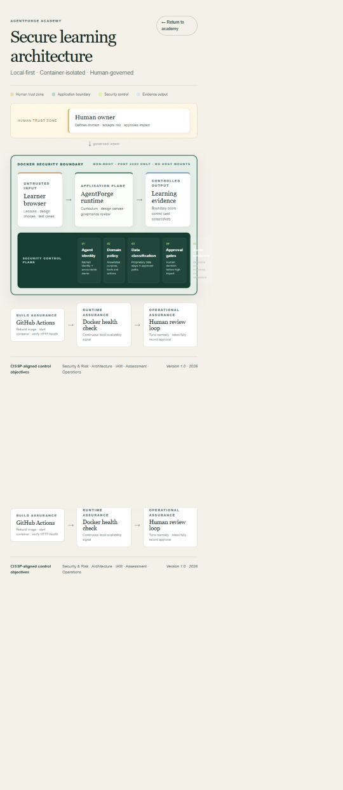

# AgentForge Academy

**Build useful AI agents. Keep them in bounds.**

AgentForge Academy is a beginner-first, local learning application for progressing from basic agent concepts to enterprise agentic-AI governance. It combines an interactive curriculum, a safe agent design canvas, practical IT and business-analytics blueprints, and CISSP-aligned control reviews.

> This project uses CISSP-aligned security principles. It does not claim that the author or learner holds the CISSP certification.



## What you can learn

- How an agent differs from a chatbot
- How to define an agent's goal, domain, tools, memory, data, and stop conditions
- How to design IT service-desk, access-review, analytics, and security agents
- How to use agent identities, least privilege, data classification, approvals, and audit evidence
- How to test prompt injection, excessive agency, data leakage, and out-of-domain behavior
- How to move from a prototype to a governed enterprise service

## Start in three steps

### 1. Install Docker Desktop

Install [Docker Desktop](https://www.docker.com/products/docker-desktop/), open it, and wait until it reports that the engine is running.

### 2. Download this repository

On the GitHub page, select **Code → Download ZIP**, extract it, and open PowerShell in the extracted folder.

### 3. Start the academy

```powershell
docker compose up --build -d
```

Open [http://localhost:3000](http://localhost:3000). That is the entire installation.

To stop it:

```powershell
docker compose down
```

Your machine does not need Node.js, Python, or a cloud account. Docker contains the required runtime.

## Verify that it works

```powershell
docker compose ps
docker compose logs --tail 30
```

The container should show `healthy`, and the logs should contain `Production server running at http://0.0.0.0:3000`.

## Learning experience



The five-level path moves through Foundations, Builder, Defender, Operator, and Architect. The workbench then lets learners switch among concept instruction, a safe design canvas, and governance review.




## Security architecture

See the complete [architecture and CISSP control mapping](docs/ARCHITECTURE.md). The current lab intentionally:



- Runs locally and does not transmit learner designs
- Runs the application as a non-root container user
- Exposes only port 3000
- Mounts no host folders, secrets, or Docker socket
- Does not execute arbitrary agent tools
- Keeps learning exercises separate from production systems

## Rebuild or teach from this project

Follow the [complete beginner walkthrough](docs/WALKTHROUGH.md). It explains every file, how the container build works, how to add a lesson safely, how to test changes, and how to use the project as a portfolio demonstration.

## Repository map

```text
app/                    Interactive curriculum and visual design
docs/ARCHITECTURE.md    Architecture diagram, boundaries, control mapping
docs/WALKTHROUGH.md     Beginner build-and-teach guide
screenshots/            Verified portfolio evidence
.github/workflows/      Automated container build and smoke test
Dockerfile              Reproducible non-root production image
compose.yaml            One-command local startup and health check
```

## Responsible use

This is an educational design lab, not a production authorization service. Before connecting a real agent to company systems, add organizational identity, encrypted persistent storage, policy-as-code enforcement, isolated tool execution, centralized monitoring, formal risk acceptance, and incident-response integration.

## License

MIT — use it, teach it, and improve it.
