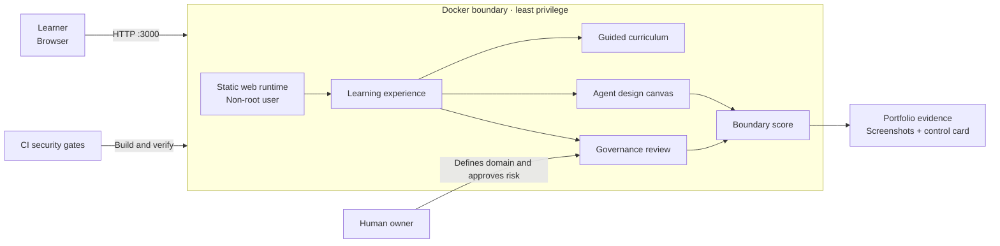

# AgentForge Academy architecture

The application is deliberately local-first. Learning state remains in the browser process and no proprietary prompts or designs are transmitted to third parties.

## Trust boundaries

1. The browser is an untrusted input boundary.
2. The container runs as an unprivileged user and exposes only port 3000.
3. No host folders, Docker socket, secrets, or external APIs are mounted.
4. The design canvas is educational and does not execute arbitrary agent tools.
5. A production extension should add authentication, durable encrypted storage, policy-as-code, audit export, and an isolated tool-execution plane.

## CISSP-aligned control mapping

| Design decision | Security purpose | CISSP domain alignment |
| --- | --- | --- |
| Named agent owner and domain | Accountability and governance | Security and Risk Management |
| Explicit tool and data allowlists | Least privilege | Identity and Access Management |
| Approval before high-impact action | Separation of duties | Security Operations |
| Container isolation and non-root runtime | Reduce attack surface | Security Architecture and Engineering |
| Tests, health checks, and evidence | Assurance and repeatability | Security Assessment and Testing |
